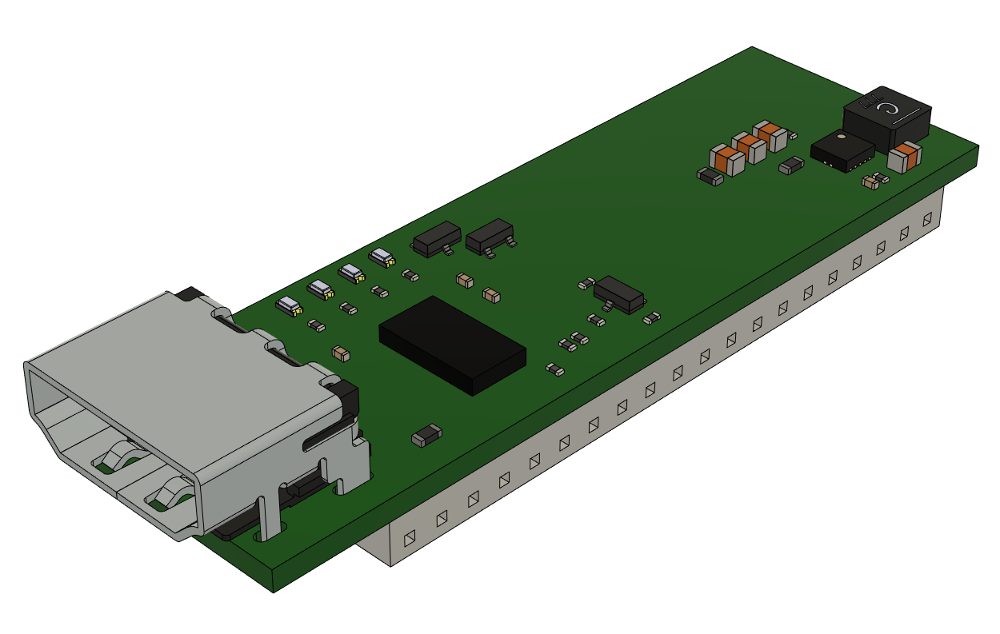
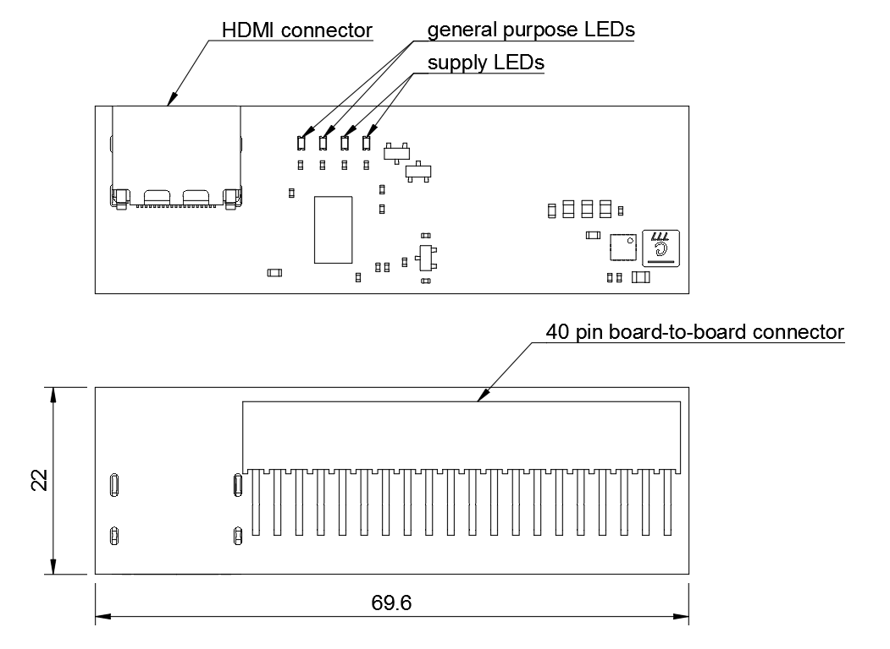

Snickerdoodle HDMI breakout
===========================

Copyright (c) 2020 Antmicro <`www.antmicro.com <https://www.antmicro.com>`_>

This repository contains open hardware design files for an expansion board compatible with `krtkl's breakyBreaky carrier board <https://www.xilinx.com/products/boards-and-kits/1-gex6t6.html>`_ for the `snickerdoodle <https://krtkl.com/snickerdoodle/>`_ prototyping platform.

The design files were created in KiCad.

The expansion board breaks out the HDMI interface on a regular HDMI connector.
The TMDS data lanes from this connector are connected to the FPGA fabric in the Zynq 7000 on the snickerdoodle module.
The expansion board should be connected to the ``JB2`` pinhead available on the breakyBreaky board. It is compatible with breakyBreaky rev.3.0 and rev.4.0 (make sure pin 1 indicators align).

Dimensions and layout
---------------------

The image below shows the HDMI Expansion board's dimensions and layout.

For more information regarding electrical connections please refer to the schematic sheets and compare them against the `offcial documentation <https://github.com/krtkl/open-source-schematics>`_ of breakyBreaky and snickerdoodle module.
